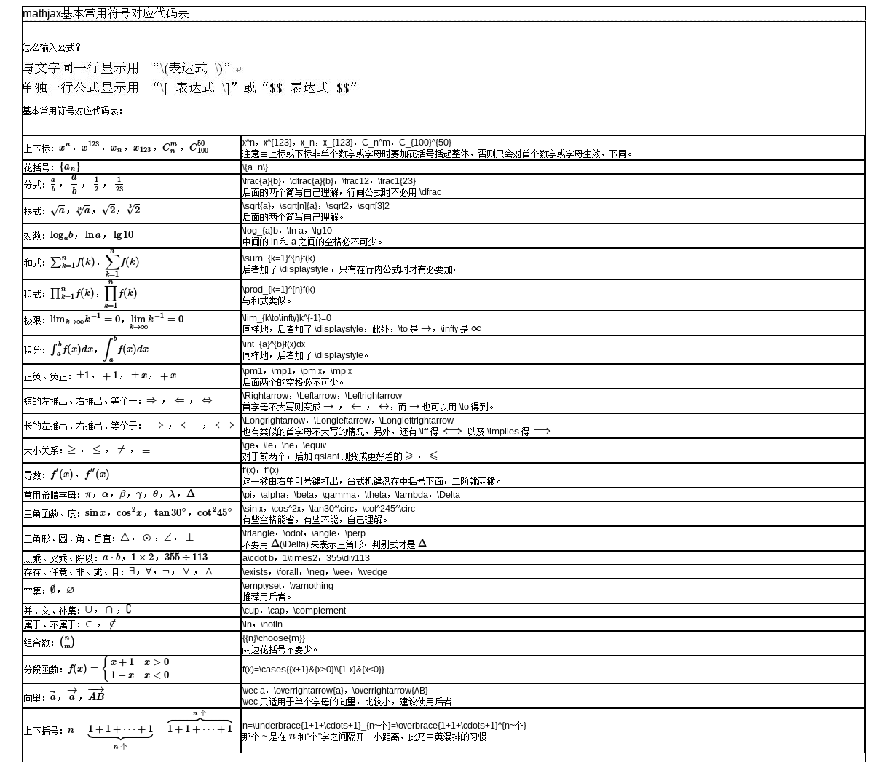

## pandoc

### pandoc xelatex with Chinese

pandoc to pdf file with Chinese need using xelatex and select the main font-name

[link][https://github.com/jgm/pandoc/wiki/Pandoc-with-Chinese]
`pandoc from.md -o to.pdf --latex-engine=xelatex -V mainfont=WenQuanYi\ Micro\ Hei\ Mono`

## linux default application

### set default application

```
xdg-mime default llpp.desktop application/pdf
```

## usage of rsync

### start rsync daemon

```
systemctl start rsyncd.service
```

### `/etc/rsyncd.conf`

```
man rsyncd.conf
```

### connnect to rsync daemon

```
rsync -av hostname::module_name # list files
rsync -av hostname::module_name /dest/path # copy files
```

### Problems

1. how to config authorized user?

[config example][rsync config example]

## Latex

### 带边框的文本

- 包：framed
- environment: framed
- [WikiBooks-Boxes][]

### 字体颜色

- 包：color
- command: \textcolor{red}{text}
- command: \colorbox{red}{text}

### strike-out

- 包：ulem
- command：\soul{text}
- ulem包会修改\empth{}的字体，
  - \normalem
  - \ULforem

### cite style

[someone et al. year][latex natbib]

[Bibliography and citation style][latex citation style]

### [PDF file Presentation]

[someone et al. year][latex natbib]

[Bibliography and citation style][latex citation style]

### [PDF file Presentation]

## html

- 设置`charset`
`<meta http-equiv="content-type" content="text/html; charset=UTF-8">`
- 链接外部CSS文件
`<link rel="stylesheet" type="text/css" href="mystyle.css">`

## Vim

### ctags

#### generate tags file of current directory

```bash
ctags -R .
ctags -R -f . ./directory/to/store/tags
```

### taglist

```vimscript
:TlistToggle
```

### Alt Macros in console version of vim

```bash
set convert-meta on
```
then, `set <m-i>=^[i`

### table-mode

	| <Leader>tm table mode 开关
	| <Leader>tt 使用g:table_mode_delimiter定义的分隔符插入表格
	| <Leader>T 使用用户输入的分隔符插入表格
	| <Leader>tr 重新对齐
	| [| 移动到前一个表格
	| ]| 移动到下一个表格
	| {| 移动到上面一个表格
	| }| 移动到下面一个表格
	| || 插入表头边框
	| <Leader>tdd 删除一行
	| <Leader>tdc 删除一列

	| <Leader>tm table mode 开关
	| <Leader>tt 使用g:table_mode_delimiter定义的分隔符插入表格
	| <Leader>T 使用用户输入的分隔符插入表格
	| <Leader>tr 重新对齐
	| [| 移动到前一个表格
	| ]| 移动到下一个表格
	| {| 移动到上面一个表格
	| }| 移动到下面一个表格
	| || 插入表头边框
	| <Leader>tdd 删除一行
	| <Leader>tdc 删除一列


### [Resize splits window more quickly][vim resize window]

```vimscript
:resize/res 60
:resize +5
:resize -5

:vertical resize 80
:vertical resize +5
:vertical resize -5
```

## Bash

### AWK
- 打印文件的奇数行`awk 'NR%2'`

### 提取文件名称和后缀

[unix-linux-extract-filename-and-extension-in-bash][]

```
for filename in `ls *.*`
do
	$name=${filename%%.*};
	$ext=${filename##*.};
	echo $name+$ext;
done
```

## Other

### do not bell on tab-completion in linux

add `set bell-style none` to `/etc/inputrc`

### [MyPaint基础小教程][]

### qv4l2
camera setting

### [Mathjax 符号对照表][mathjax symbols]



### [farbox协作规则][farbox editor]

### Split cue file to flac

[cue spliting][] `shnsplit`

### Convert single ape file to ape

```bash
ffmpeg -i inputaudio.ape outputaudio.flac
```

## To-Read

- [Markdown and reStructuredText][]
- [Draw Presentable Trees][pymag-trees]: algorithms to draw trees

## Other

[unofficial user repo for archlinux][]


[unofficial user repo for archlinux]: https://wiki.archlinux.org/index.php/Unofficial_user_repositories#kps

[rsync config example]: http://www.jveweb.net/en/archives/2011/01/running-rsync-as-a-daemon.html
[WikiBooks-Boxes]: http://en.wikibooks.org/wiki/LaTeX/Boxes
[unix-linux-extract-filename-and-extension-in-bash]: http://www.cyberciti.biz/faq/unix-linux-extract-filename-and-extension-in-bash/

[Markdown and reStructuredText]: https://gist.github.com/dupuy/1855764
[MyPaint基础小教程]: https://forum.suse.org.cn/viewtopic.php?f=6&t=900
[vim resize window]: http://vim.wikia.com/wiki/Resize_splits_more_quickly
[latex natbib]: http://en.wikibooks.org/wiki/LaTeX/Bibliography_Management#Natbib
[latex citation style]: http://sites.stat.psu.edu/~surajit/present/bib.htm
[PDF file Presentation]: http://sites.stat.psu.edu/~surajit/present/pdf.html
[mathjax symbols]: http://www.lyyz.net/blog/user1/zyair/archives/2012/570.html
[farbox editor]: http://help.farbox.com/read/basic-writting

[cue spliting]: https://wiki.archlinux.org/index.php/APE+CUE_Splitting

[pymag-trees]: http://billmill.org/pymag-trees/
