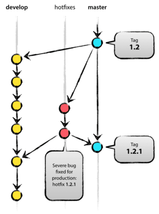

## Latex
### 带边框的文本

- 包：framed
- environment: framed
- [WikiBooks-Boxes][]

### 字体颜色

- 包：color
- command: \textcolor{red}{text}
- command: \colorbox{red}{text}

### strike-out

- 包：ulem
- command：\soul{text}
- ulem包会修改\empth{}的字体，
  - \normalem
  - \ULforem

### cite style

[someone et al. year][latex natbib]

[Bibliography and citation style][latex citation style]

### [PDF file Presentation]

[someone et al. year][latex natbib]

[Bibliography and citation style][latex citation style]

### [PDF file Presentation]

## html

- 设置`charset`
`<meta http-equiv="content-type" content="text/html; charset=UTF-8">`
- 链接外部CSS文件
`<link rel="stylesheet" type="text/css" href="mystyle.css">`

## CSS

CSS继承

```
所有元素可继承：visibility和cursor

内联元素和块元素可继承：letter-spacing、word-spacing、white-space、line-height、color、
font、font-family、font-size、font-style、font-variant、font-weight、text- decoration、
text-transform、direction

块状元素可继承：text-indent和text-align

列表元素可继承：list-style、list-style-type、list-style-position、list-style-image

表格元素可继承：border-collapse

不可继承的：display、margin、border、padding、background、
height、min-height、max- height、width、min-width、max-width、
overflow、position、left、right、top、 bottom、z-index、
float、clear、table-layout、vertical-align
```

## javascript

### 按照字母序比较字符串 
使用`string.localeCompare()`

[tutorialspoint][js localeCompare]

### 事件处理的运行环境

- 通过设置属性注册事件处理函数`e.onClick = function(){}`: _this指目标对象_
- `addEventListener("click", function(){}, true)`： _this指目标对象_
- `attachEvent("onclick", function(){})`： 作为函数调用，_this指全局对象windows_

调用顺序：

1. 设置属性/HTML属性
2. addEventListener()
3. attachEvent()

事件冒泡和捕获的顺序相反

## CSS

### CSS设计技巧

[from][css design pattern]

> seperate `width` `padding/border` `margin`

- use a additional label to separate `width` and `padding/border`

```CSS
.box{width:300px; height:80px;}
.box .roundBox{padding:10px;}
.box .roundBox-modifed{padding:10px 15px; border:1px solid #ccc;}
```

- separate `margin`

```CSS
.m10{margin:10px}
.m15{margin:15px}
.m30{margin:30px}
.mt5{margin-top:5px}
.mt10{margin-top:10px}
.mt15{margin-top:15px}
.mt20{margin-top:20px}
.mt30{margin-top:30px}
.mt50{margin-top:50px}
.mt100{margin-top:100px}
.mb10{margin-bottom:10px}
.mb15{margin-bottom:15px}
.mb20{margin-bottom:20px}
.mb30{margin-bottom:30px}
.mb50{margin-bottom:50px}
.mb100{margin-bottom:100px}
.ml5{margin-left:5px}
.ml10{margin-left:10px}
.ml15{margin-left:15px}
.ml20{margin-left:20px}
.ml30{margin-left:30px}
.ml50{margin-left:50px}
.ml100{margin-left:100px}
.mr5{margin-right:5px}
.mr10{margin-right:10px}
.mr15{margin-right:15px}
.mr20{margin-right:20px}
.mr30{margin-right:30px}
.mr50{margin-right:50px}
.mr100{margin-right:100px}
```
### 选择器[CSS Selector][]

- 组选择器

		h1, h2, h3, .class1{}

- 派生(后代)选择器

        li{}
        strong{}
        li string{}

- 子元素选择器

        h1 > strong {}

- 相邻兄弟选择器

        h1 + p {}


## Vim

### ctags

#### generate tags file of current directory
```bash
ctags -R .
ctags -R -f . ./directory/to/store/tags
```

### taglist
```vimscript
:TlistToggle
```
### Alt Macros in console version of vim
```bash
set convert-meta on
```
then, `set <m-i>=^[i`

### table-mode

	| <Leader>tm table mode 开关
	| <Leader>tt 使用g:table_mode_delimiter定义的分隔符插入表格
	| <Leader>T 使用用户输入的分隔符插入表格
	| <Leader>tr 重新对齐
	| [| 移动到前一个表格
	| ]| 移动到下一个表格
	| {| 移动到上面一个表格
	| }| 移动到下面一个表格
	| || 插入表头边框
	| <Leader>tdd 删除一行
	| <Leader>tdc 删除一列

	| <Leader>tm table mode 开关
	| <Leader>tt 使用g:table_mode_delimiter定义的分隔符插入表格
	| <Leader>T 使用用户输入的分隔符插入表格
	| <Leader>tr 重新对齐
	| [| 移动到前一个表格
	| ]| 移动到下一个表格
	| {| 移动到上面一个表格
	| }| 移动到下面一个表格
	| || 插入表头边框
	| <Leader>tdd 删除一行
	| <Leader>tdc 删除一列


### [Resize splits window more quickly][vim resize window]
```vimscript
:resize/res 60
:resize +5
:resize -5

:vertical resize 80
:vertical resize +5
:vertical resize -5
```

## Bash

### AWK
- 打印文件的奇数行`awk 'NR%2'`

### 提取文件名称和后缀

[unix-linux-extract-filename-and-extension-in-bash][]

```
for filename in `ls *.*`
do
	$name=${filename%%.*};
	$ext=${filename##*.};
	echo $name+$ext;
done
```
## Git
[git 操作详解][git remote]


几个概念:

- 仓库
- 提交
- 分支
- 日志

```git
$ git remote add origin some-url #设置仓库
$ git commit --amend -m "commit message." #修补提交（修补最近一次的提交而不创建新的提交）
$ git push -u origin master #将代码从本地传回到仓库
$ git branch checkout master # 切换到主分支

$ git log # 查看提交信息
$ git log --pretty=oneline # 以整洁的单行形式显示提交信息
$ git log --stat # 查看提交信息及更新的文件

$ git archive --format tar --output /path/to/file.tar master # 将 master 以 tar 格式打包到指定文件
```
使用 Git 的一些基本守则：
当要commit/提交patch时：

- 使用 git diff --check 检查行尾有没有多余的空白
- 每个 commit 只改一件事情。如果一个文档有多个变更，使用 git add --patch 只选择文档中的部分变更进入 stage
- 写清楚 commit message

### Git Branch Model
两个branch of infinite lifetime:

- origin/master: code of `HEAD` always reflect the `product-ready` state
- origin/develop: code of `HEAD` always relect the latest changes for next release

principle of `master` and `develop`:
> When the source code in the develop branch reaches a stable point and is ready to be released, all of the changes should be merged back into master somehow and then tagged with a release number. 

Under this condition, a `git hook script` can be used to generate software of new version.

article [git branch model][] gives three type of support branches

- feature branch
	- branch off from `develop` and merged back into `develop` eventually

```bash
$ git checkout -b myfeature develop #Switched to a new branch "myfeature"
(do something)
$ git checkout develop #Switched to branch 'develop'
$ git merge --no-ff myfeature #Updating
(Summary of changes)
$ git branch -d myfeature #Deleted branch myfeature
$ git push origin develop 
```

- release branch
	- branch off from `develop` and merged back into `develop` and `master` eventually
	- when `develop` branch is in a desired state for next release and the version number is decided.
	
```bash
$ git checkout -b release-1.2 develop #Switched to a new branch "release-1.2"
(modify files to the new version number)
$ git commit -a -m "Bumped version number to 1.2"
(apply bug fixes)
(...)
$ git checkout master #Switched to branch 'master'
$ git merge --no-ff release-1.2 #Merge made by recursive.
(Summary of changes)
$ git tag -a 1.2
```
```bash
$ git checkout develop #Switched to branch 'develop'
$ git merge --no-ff release-1.2
```
```bash
$ git branch -d release-1.2
```
			
- hotfix branch
	- branch off from `develop` and merged back into `develop` and `master` eventually

	


## Other
### do not bell on tab-completion in linux
add `set bell-style none` to `/etc/inputrc`

### [MyPaint基础小教程][]

### qv4l2
camera setting

### [Mathjax 符号对照表][mathjax symbols]

### [farbox协作规则][farbox editor]

### Split cue file to flac
[cue spliting][] `shnsplit`

### Convert single ape file to ape

```bash
ffmpeg -i inputaudio.ape outputaudio.flac
```

## To-Read
- [Markdown and reStructuredText][]
- [GitHub Mark][]
- [Draw Presentable Trees][pymag-trees]: algorithms to draw trees

[CSS Selector]: http://www.w3school.com.cn/css/css_syntax_descendant_selector.asp
[css design pattern]: http://www.hicss.net/separation-of-powers-model-in-css-design-patterns/
[WikiBooks-Boxes]: http://en.wikibooks.org/wiki/LaTeX/Boxes
[unix-linux-extract-filename-and-extension-in-bash]: http://www.cyberciti.biz/faq/unix-linux-extract-filename-and-extension-in-bash/

[GitHub Mark]: https://github.com/github/markup
[Markdown and reStructuredText]: https://gist.github.com/dupuy/1855764
[MyPaint基础小教程]: https://forum.suse.org.cn/viewtopic.php?f=6&t=900
[js localeCompare]: http://www.tutorialspoint.com/javascript/string_localecompare.htm
[vim resize window]: http://vim.wikia.com/wiki/Resize_splits_more_quickly
[latex natbib]: http://en.wikibooks.org/wiki/LaTeX/Bibliography_Management#Natbib
[latex citation style]: http://sites.stat.psu.edu/~surajit/present/bib.htm
[PDF file Presentation]: http://sites.stat.psu.edu/~surajit/present/pdf.html
[mathjax symbols]: http://www.lyyz.net/blog/user1/zyair/archives/2012/570.html
[farbox editor]: http://help.farbox.com/read/basic-writting

[git branch model]: http://nvie.com/posts/a-successful-git-branching-model/
[git remote]: http://www.ruanyifeng.com/blog/2014/06/git_remote.html

[cue spliting]: https://wiki.archlinux.org/index.php/APE+CUE_Splitting

[pymag-trees]: http://billmill.org/pymag-trees/
