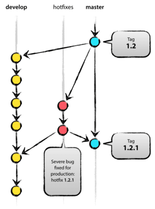

# Git Usage

## Some Links

- [Git Book][]
- [git 操作详解][git remote]
- [GitHub Mark][]

## Some Concepts


- 仓库
- 提交
- 分支
- 日志

### [HEAD][git HEAD] orgin master

[HEAD orgin master][]

**HEAD**: the current commit your repo is on. Most of the time HEAD points to the latest commit in your branch, but that doesn't have to be the case. HEAD really just means "what is my repo currently pointing at". Thanks svick for the heads up on this one (no pun intended)  
In the event that the commit HEAD refers to is not the tip of any branch, this is called a "detached head".

**master**: The name of the default branch that git creates for you when first creating a repo. In most cases, "master" means "the main branch". Most shops have everyone pushing to master, and master is considered the definitive view of the repo. But it's also common for release branches to be made off of master for releasing. Your local repo has its own master branch, that almost always follows the master of a remote repo.

**origin**: The default name that git gives to your main remote repo. Your box has its own repo, and you most likely push out to some remote repo that you and all your coworkers push to. That remote repo is almost always called origin, but it doesn't have to be.

HEAD is an official notion in git, HEAD always has a well defined meaning. master and origin are common names usually used in git but they don't have to be.


### Frequently Used Commands

```git
$ git remote add origin some-url #设置仓库
$ git commit --amend -m "commit message." #修补提交（修补最近一次的提交而不创建新的提交）
$ git push -u origin master #将代码从本地传回到仓库
$ git branch checkout master # 切换到主分支

$ git log # 查看提交信息
$ git log --pretty=oneline # 以整洁的单行形式显示提交信息
$ git log --stat # 查看提交信息及更新的文件

$ git archive --format tar --output /path/to/file.tar master # 将 master 以 tar 格式打包到指定文件
```
### Git diff

```bash
git diff
git diff --staged # check difference between staged and last commit
git diff --cached #  same as --staged
git diff --check # 检查行尾多余的空白
```

```bash
git diff remotename/branchname:remote/path/file1.txt local/path/file1.txt
# This will show the differences going from the remote file to the local file. Or to view the differences in the other direction:
git diff HEAD:local/path/file1.txt remotename/branchname:remote/path/file1.txt
#Basically you can diff any two files anywhere using this notation:
git diff ref1:path/to/file1 ref2:path/to/file2
# where ref1 and ref2 could be branch names, remotename/branchname, or even commit SHAs.

# what change was introduced to origin/master in the last 4 commits?
git diff origin/master origin/master~3

If you want to diff your current working directory against the 5th most recent commit on origin/master, you would omit the first argument:
git diff origin/master~4
```

### Usage Rules

当要commit/提交patch时：

- 使用 git diff --check 检查行尾有没有多余的空白
- 每个 commit 只改一件事情。如果一个文档有多个变更，使用 git add --patch 只选择文档中的部分变更进入 stage
- 写清楚 commit message

### Git Branch Model

两个branch of infinite lifetime:

- origin/master: code of `HEAD` always reflect the `product-ready` state
- origin/develop: code of `HEAD` always relect the latest changes for next release

principle of `master` and `develop`:

> When the source code in the develop branch reaches a stable point and is ready to be released, all of the changes should be merged back into master somehow and then tagged with a release number. 

Under this condition, a `git hook script` can be used to generate software of new version.

article [git branch model][] gives three type of support branches

#### 1. feature branch

- branch off from `develop` and merged back into `develop` eventually

```bash
$ git checkout -b myfeature develop #Switched to a new branch "myfeature"
(do something)
$ git checkout develop #Switched to branch 'develop'
$ git merge --no-ff myfeature #Updating
(Summary of changes)
$ git branch -d myfeature #Deleted branch myfeature
$ git push origin develop 
```

#### 2. release branch

- branch off from `develop` and merged back into `develop` and `master` eventually
- when `develop` branch is in a desired state for next release and the version number is decided.
	
```bash
$ git checkout -b release-1.2 develop #Switched to a new branch "release-1.2"
(modify files to the new version number)
$ git commit -a -m "Bumped version number to 1.2"
(apply bug fixes)
(...)
$ git checkout master #Switched to branch 'master'
$ git merge --no-ff release-1.2 #Merge made by recursive.
(Summary of changes)
$ git tag -a 1.2
```
**why use tags?**

```bash
$ git checkout develop #Switched to branch 'develop'
$ git merge --no-ff release-1.2
```

```bash
$ git branch -d release-1.2
```
			
#### 3. hotfix branch
- branch off from `develop` and merged back into `develop` and `master` eventually



## Usage

### Git force pull to overwrite local files

```
git fetch --all
git reset --hard origin/master
git pull origin master 
```

### [revert to a previous git commit][]

#### Temporarily switch to a different commit

```
git checkout <commit_sha>
```

if you want make a new branch from a commit previous, by

```
git checkout -b new-branch <commit_sha>
```

#### **Hard delete unpublished commits**

**use reset** to delete the commit from history

```
git reset --hard <commit_sha>
```

above will destroy all the local modifications.

```
git stash
git reset --hard <commit_sha>
git stash pop
```

command above first stash the local change, then do a hard reset,
after all done, restore the local change.

#### **Undo published commits with new commits**

```
git revert HEAD~2..HEAD
git commit -m 'message '
```

command above revert the last two commits by add two revert commits,
the commit history is maintained.

maybe you want to revert a merge commit, by(not tried)

```
git revert -m 1 <merge_commit_sha>
```

### Reset current HEAD to the specified state


```bash
git reset HEAD@{1}
git reflog ### view the log of all ref updates (e.g., checkout, reset, commit, merge)
```

### delete branch in remote repo

```bash
git push origin --delete <branchName> ## or
git push origin :<branchName>
```

### Delete files in remote repo **ONLY**?

```bash
git rm --cached filelist
```

>  --cached  
Use this option to unstage and remove paths only from the index.
Working tree files, whether modified or not, will be left alone.

then commit the change and push change to remote repo.

## checkout file in index(staged file)

```bash
# this restores the file status in the index
git reset -- <file>
# then check out a copy from the index
git checkout -- <file>
```
## merge one file from another branch

```
git checkout -p another-branch /path/to/file
```

this approach using file in another branch to substitude(not actual merge)
```
git checkout another-branch /path/to/file
```


[Git Book]: http://git-scm.com/book/en/v2
[git branch model]: http://nvie.com/posts/a-successful-git-branching-model/
[git remote]: http://www.ruanyifeng.com/blog/2014/06/git_remote.html
[GitHub Mark]: https://github.com/github/markup
[HEAD orgin master]: http://stackoverflow.com/questions/8196544/what-are-the-git-concepts-of-head-master-origin
[git HEAD]: http://git-scm.com/book/en/v2/Git-Internals-Git-References#The-HEAD
[revert to a previous git commit]: http://stackoverflow.com/questions/4114095/revert-to-a-previous-git-commit

