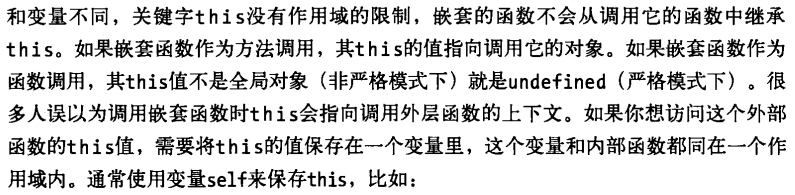

## JavaScript
### JavaScript Object
[From][Developers Should Know About JavaScript]
This article presented three key pieces of knowledge:

1. Every JavaScript object is a dictionary.
2. Every JavaScript function is an object.
3. Every JavaScript object references a prototype object. 

> JavaScript objects are entirely different from C# and VB objects because they are ultimately a collection of name and value pairs, like a dictionary.

> A JavaScript function is a chunk of executable code, but it's also a first class object. This is fundamentally different from methods in C# and Visual Basic. We can invoke methods in C# and VB, but we can't treat those methods as datatypes (although delegates and lamda expressions in C# make this area a little bit fuzzy). In JavaScript, we can manipulate functions using other JavaScript code, assign functions to variables, store functions inside arrays, nest functions inside other functions, and pass functions as a parameter to other functions.

> Technically, what we've done with the add function is create a new function object, and assigned the function object to a variable named add. We could take the same function object and assign it to different variables and invoke the function through those variables. 

> Every JavaScript object references a prototype object. 

- class-based programming language: To create objects, we must first write a class that defines fields, properties, methods, and events. When we create a new object, we are creating an instance of that class. 
- prototype-based programming language: Every object has a prototype property that references its prototype object. Any properties and methods that are a part of an object's prototype will appear as properties and methods of the object itself.

**What happens when we use new operator?**
1. Create an empty object.
2. Assign the value of the constructor function's prototype property to the new object's prototype property.
3. Invoke the constructor function, passing the new object as the "this" reference. 


> You can almost think of every object as inheriting from it's prototype, because it will include all the properties and methods defined by its prototype.
and the object of the function can be a static object to these objects

> A closure in JavaScript is an inner function that references a local var or parameter in its outer function. Those local variables and parameters, which typically go out of scope when the outer function finishes execution are now "enclosed" by the inner function, which can continue to reference and use those variables. 

**private members can be implemented by closure**
```JavaScript
// parameters are in closure
function Point(x, y) {	
	this.get_x = function() { return x; }
	this.set_x = function(value) { x = value; }
	this.get_y = function() { return y; }
	this.set_y = function(value) { y = value; }
}
```

**namespace can be simulated using objects**

### [JavaScript Closure][js closure]
**What is a closure>**
> A closure is an inner function that has access to the outer (enclosing) function’s variables—scope chain. The closure has three scope chains: it has access to its own scope (variables defined between its curly brackets), it has access to the outer function’s variables, and it has access to the global variables. 


### [Functions and Methods][js apply and call]
> A function might have its own methods - then remember that every function in JavaScript is an objecat. You might also wonder what the difference is between a function and a method. I believe the descriptors 'function' and 'method' are just a JavaScript convention. Functions stand on their own (there is an alert() function, for example), while methods are functions inside an object's dictionary, and we invoke them through the object reference. Every JavaScript object has a toString() method, for example, and we can use the toString() method on a function object to see its source code.
>> Note that the inner function cannot call the outer function’s arguments object, however, even though it can call the outer function’s parameters directly.

```JavaScript
function foo(){
	alert("x");
}
alert(foo.toString());
```

`func.apply()`和`func.call()`可以指定func中的`this`来执行函数. 
函数定义中所有用this访问的methods和variables都会被object中的对应methods和variable替代.

**使用apply()函数创建delegate**
```JavaScript
var o = { x: 15 };
function f(message1, message2){
	alert(message1 + (this.x * this.x) + message2);
}
function g(object, func){          
	// arguments[0] == object
	// arguments[1] == func
	var args = []; // empty array
	// copy all other arguments we want to "pass through"
	for(var i = 2; i < arguments.length; i++){
			args.push(arguments[i]);
	}
	func.apply(object, args);
}
g(o, f, "The value of x squared = ", ". Wow!");
```
### bind() function
[From][js apply call bind]
- Bind Allows Us to Set the this Value on Methods

- Bind Allows us to Borrow Methods
- Bind Allows Us to Curry a Function

```JavaScript
function greet (gender, age, name) {
	// if a male, use Mr., else use Ms.
	var salutation = gender === "male" ? "Mr. " : "Ms. ";
	if (age > 25) {
		return "Hello, " + salutation + name + ".";
	}
	else {
		return "Hey, " + name + ".";
	}
}
// So we are passing null because we are not using the "this" keyword in our greet function.
var greetAnAdultMale = greet.bind (null, "male", 45);
greetAnAdultMale ("John Hartlove"); // "Hello, Mr. John Hartlove."
var greetAYoungster = greet.bind (null, "", 16);
greetAYoungster ("Alex"); // "Hey, Alex."
greetAYoungster ("Emma Waterloo"); // "Hey, Emma Waterloo."
```

### Scenarios when the this keyword becomes tricky
[From][js understand this]
- **Fix this when used in a method passed as a callback**
```JavaScript
// We have a simple object with a clickHandler method that we want to use
//when a button on the page is clicked
var user = {
	data:[ {name:"T. Woods", age:37}, {name:"P. Mickelson", age:43} ],
	clickHandler:function (event) {
	var randomNum = ((Math.random () * 2 | 0) + 1) - 1; // random number between 0 and 1
		// This line is printing a random person's name and age from the data array
		console.log (this.data[randomNum].name + " " + this.data[randomNum].age);
	}
}
// The button is wrapped inside a jQuery $ wrapper, so it is now a jQuery object
// And the output will be undefined because there is no data property on the button object
$ ("button").click (user.clickHandler); // Cannot read property '0' of undefined

```
_solution_: use `bind` method
```
$("button").click (user.clickHandler.bind (user)); // P. Mickelson 43
```
- **Fix this inside closure**
> It is important to take note that closures cannot access the outer function’s this variable by using the this keyword because the this variable is accessible only by the function itself, not by inner functions.

_solution_: set the this value to another variable before we enter the forEach method.

- **Fix this when method is assigned to a variable**
> The this value escapes our imagination and is bound to another object, if we assign a method that uses this to a variable.

_solution_:specifically setting the this value with the bind method
```JavaScript
var showUserData = user.showData;
showUserData();
```
```JavaScript
var showUserData = user.showData.bind(user);
showUserData();
```

- **Fix this when borrowing methods**
```JavaScript
// We have two objects. One of them has a method called avg () that the other doesn't have
// So we will borrow the (avg()) method
var gameController = {
	scores :[20, 34, 55, 46, 77],
	avgScore:null,
	players :[ {name:"Tommy", playerID:987, age:23}, {name:"Pau", playerID:87, age:33} ]
}
var appController = {
	scores :[900, 845, 809, 950],
	avgScore:null,
	avg :function () {
		var sumOfScores = this.scores.reduce (function (prev, cur, index, array) {
			return prev + cur;
		});
		this.avgScore = sumOfScores / this.scores.length;
	}
}
//If we run the code below,
//the gameController.avgScore property will be set to the average score from the
//appController object "scores" array
gameController.avgScore = appController.avg();
```
_solution:_use `apply()` method
```JavaScript
appController.avg.apply (gameController, gameController.scores);
```


### 方法链Methods Chain


### 理解this作用域和closure
![学习JavaScript闭包（Closure）][js closure]
可以通过对象的形式返回多个闭包:
```JavaScript
var foo = ( function() {
	var secret = 'secret';
	// “闭包”内的函数可以访问 secret 变量，而 secret 变量对于外部却是隐藏的
	return {
		get_secret: function () {
			// 通过定义的接口来访问 secret
			return secret;
		},
		new_secret: function ( new_secret ) {
			// 通过定义的接口来修改 secret
			secret = new_secret;
		}
	};
} () );
```


如下两段代码:
代码1
```JavaScript
var name = "The Window";

var object = {
  name : "My Object",
  getNameFunc : function(){
    return function(){
      return this.name;
    };
  }
};

var a = {
  name: "hah",
  cc: object.getNameFunc()
};

console.log(object.getNameFunc()());
console.log(a.cc());
```
代码2
```JavaScript
var name = "The Window";
　var object = {
　　name : "My Object",
　　getNameFunc : function(){
　　　var that = this;
　　　return function(){
　　　　return that.name;
　　　};
　　}
};

console.log(object.getNameFunc()()); 
```

### 把一个`{children:[,,,]}`数组转换成一个`{source:,target}`数组
```JavaScript
function d3_layout_hierarchyLinks(nodes) {
	return d3.merge(nodes.map(function(parent) {
		return (parent.children || []).map(function(child) {
			return {source: parent, target: child};
	});
}));
```


[js closure]: http://www.ruanyifeng.com/blog/2009/08/learning_javascript_closures.html
[js apply and call]: http://odetocode.com/blogs/scott/archive/2007/07/04/function-apply-and-function-call-in-javascript.aspx
[js understand this]: http://javascriptissexy.com/understand-javascripts-this-with-clarity-and-master-it/
[js apply call bind]: http://javascriptissexy.com/javascript-apply-call-and-bind-methods-are-essential-for-javascript-professionals/
[js closure]: http://javascriptissexy.com/understand-javascript-closures-with-ease/
[Developers Should Know About JavaScript]: http://odetocode.com/Articles/473.aspx
