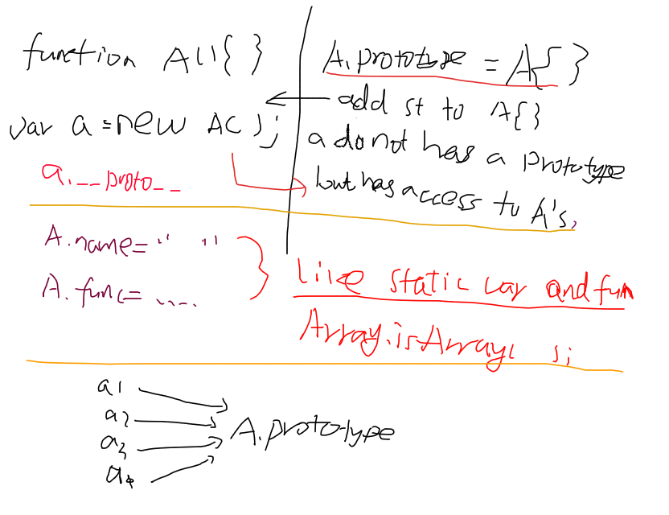

# JavaScript

### add method to object

```javascript
function Person(name, age){
	this.name = name;
	this.age = age;
}
var o = new Person("YanlongLi",12);
function get_name(){
	return this.name;
}
function get_age(){
	return this.age;
}

// generate a new function associate with a object
var get_o_name = get_name.bind(o);
var get_o_age = get_age.bind(o);

// bad way
o.get_name = get_name;
o.get_age = get_age;
console.log(o.get_name());
console.log(o.get_age());
delete o.get_name;
delete o.get_age;

// for short
console.log(get_name.call(o));
console.log(get_age.call(o));

```

## getter and setter in closure

```javascript
/*
 * different implementation of counter
 */

// object
function Counter(n){
	this.n = n;
}
Counter.prototype.count = function(){
	return this.n++;
};
Counter.prototype.reset = function(){
	this.n = 0;
}

var c = new Counter(10);
c.count();
c.count();
c.reset();

// closure
function counter(n){
	return {
		count: function(n){
			return n++;
		},
		reset: function(){
			n = 0;
		}
	}
}
var c = counter(20);
c.count();
c.reset();

// Getter and Setter with closure
function counter(n){
	return {
		get count() {return n++},
		set count(m){ n=m }
	};
}
var c = counter(100);
console.log(c.count);
console.log(c.count);
c.count = 120;
console.log(c.count);
console.log(c.count);

```

## methods to get an element's offset and size

with raw javascript

```javascript
element.style.height; // only works when `height` attr is set

element.clientHeight; // including padding
element.offsetHeight; // including padding + border
element.scrollHeight; // **???**

window.getComputedStyle(element[, pseudoElt]);

svgElement.getBBox(); // rendered offset and size
element.getBoundingClientRect(); // rendered offset and size
```

with jquery

```javascript
// if you need height of div including padding + border + margin , can use
$('#someDiv').outerHeight(true);

// if you need height of div including padding + border 
$('#someDiv').outerHeight();

// if you need height of div including padding
$('#someDiv').innerHeight();

//if you need height of div excluding margin/padding/border
$('#someDiv').height();

```


## difference between `node.parentNode` and `node.parentElement`

[see][parentNode parentElement]

> parentElement is new to Firefox 9 and to DOM4, but it has been present in all other major browsers for ages.
In most cases, it is the same as parentNode.  
The only difference comes when a node's parentNode is not an element. If so, parentElement is null.

As an example:

```javascript
document.body.parentNode; // the <html> element
document.body.parentElement; // the <html> element

document.documentElement.parentNode; // the document node
document.documentElement.parentElement; // null
```

Since the <html> element (document.documentElement) doesn't have a parent that is an element, parentElement is null.  
(There are other, more unlikely, cases where parentElement could be null, but you'll probably never come across them.)

## NPM

### `npm install` point python version

- `export PYTHON=python2.7` before execute `nmp install`
- `npm --python=python2.7 install`
- `npm config set python python2.7` to set python2 permantely


## 按照字母序比较字符串 
使用`string.localeCompare()`

[tutorialspoint][js localeCompare]

## 事件处理的运行环境

- 通过设置属性注册事件处理函数`e.onClick = function(){}`: _this指目标对象_
- `addEventListener("click", function(){}, true)`： _this指目标对象_
- `attachEvent("onclick", function(){})`： 作为函数调用，_this指全局对象windows_

调用顺序：

1. 设置属性/HTML属性
2. addEventListener()
3. attachEvent()

事件冒泡和捕获的顺序相反

## Ajax Request using JS and jQuery

[jquery ajax][]

```javascript
$.ajax({
	url: encodeURI("http://vis.pku.edu.cn/weiboutil/text/split?text=[\"你好\",\"你不好\"]")
}).done(function(data){
	console.log(data);
});

var xmlhttp=new XMLHttpRequest();
xmlhttp.onreadystatechange=function(){
	if (xmlhttp.readyState==4 && xmlhttp.status==200){
		var o = xmlhttp.responseText;
		console.log(JSON.parse(o));
	}
};
var timeout = setTimeout( function () {  
    xmlhttp.abort(); // call error callback  
}, 60*1000 /* timeout after a minute */ ); 
xmlhttp.open("GET",encodeURI("http://vis.pku.edu.cn/weiboutil/text/split?text=[\"你好\",\"你不好\"]"),true);
xmlhttp.send();
```

## how to understand a js function with `this` keyword

for example

```
var Controller = {};
Controller.control = function(type){
	switch(type){
		case 1:
			this.moveForward();
			break;
		case 2:
			this.moveBack();
			break;
		case 3:
			this.moveLeft();
			break;
		case 4:
			this.moveRight();
	}
}

function Person(){}

Person.prototype.moveForward = function(){
	console.log("I am a person, I moved forward");
};
Person.prototype.moveBack= function(){
	console.log("I am a person, I moved back");
};
Person.prototype.moveLeft= function(){
	console.log("I am a person, I moved left");
};
Person.prototype.moveRight = function(){
	console.log("I am a person, I moved right");
};

var person = new Person();

person.control = Controller.control.bind(person);
// or Person.prototype.control = Controller.control;

person.control(1); // I am a person, I moved forward
person.control(2); // I am a person, I moved back
person.control(3); // I am a person, I moved left
person.control(4); // I am a person, I moved right
```

what does this mean? in this way, the function defined a general control action,
this action is suitable for every object that has for functions `moveForward moveBack moveLeft, moveRight`

may be we can define another class called `Car` and apply the control function to Car instance;

we can add function to object at runtime.

this feature can be used when there are some objects that has a or some common actions.

## three different variables

```
function Obj()}{
	this.data = 1;
}

Obj.prototype.data = 100;

Obj.data = 1000;
```

when use `new` to create a object, we can use `this.data`,
it refers to the first variable or the second variable(only if the first variable haven't been set).
the first two variables belong to each instance separately.

the third variable is a class object, only be accessed by `Obj.data`.


when it comes to using closure to implemet `oo`,......

## implement inherit using prototype

see code below

```
function Person(name, email, website){
    this.name = name;
    this.email = email;
    this.website = website;
};
 
Person.prototype.sayHello = function(){
    var hello = "Hello, I am "+ this.name  + ", <br>" +
                "my email is: " + this.email + ", <br>" +
                "my website is: " + this.website;
    return hello;
};
 
function Student(name, email, website, no, dept){
    var proto = Object.getPrototypeOf;
    proto(Student.prototype).constructor.call(this, name, email, website);
    this.no = no;
    this.dept = dept;
}
 
// 继承prototype
Student.prototype = Object.create(Person.prototype);
 
//重置构造函数
Student.prototype.constructor = Student;
 
//重载sayHello()
Student.prototype.sayHello = function(){
    var proto = Object.getPrototypeOf;
    var hello = proto(Student.prototype).sayHello.call(this) + '<br>';
    hello += "my student no is: " + this. no + ", <br>" +
             "my departent is: " + this. dept;
    return hello;
};
 
var me = new Student(
    "Chen Hao",
    "haoel@hotmail.com",
    "http://coolshell.cn",
    "12345678",
    "Computer Science"
);
document.write(me.sayHello());
```

```javascript
B.prototype = inherit(A.prototype);
B.prototype.constructor = B;
```


in simple terms, we first execute supser class's init function in subclass, 
of course, we need to use `bind` function to bind `this` to the subclass.

then, set the subclass's prototype to super class's, `Object.create(SuperClass,prototype)`

down to this step, the initial function of subclass will be the super class's, so
we need to reset the initial function back  `SubClass.prototype.constructor = SubClass`

at last, use prototype to override function in super class.

## implement oo using closure

```JavaScript
var mypackage = {};
/**********************************************************
 *
 * implement OO using closure
 *
 **********************************************************/
mypackage.A = function(args){
	/*
	 * variables
	 */
	var data;
	/*
	 * initialize
	 */
	data = "default value";
	/*
	 * object/function
	 */
	function A(){
		/*
		 * may add some feature here
		 * return data or implement toString function
		 */
		return data;
	}
	/*
	 * function
	 */
	A.print = function(){
		console.log(data);
	};
	A.change = function(d){
		data = d;
	};
	/*
	 * return the function/object
	 */
	return A;
};

var a1 = mypackage.A();
var a2 = mypackage.A();
a1.print();
a2.print();
a1.change("a1 new value");
a1.print();
a2.print();

/**********************************************************
 *
 * implement singleton using closure
 *
 **********************************************************/

mypackage.Singleton = (function(){
	/*
	 * variables
	 */
	var data;
	/*
	 * initialize
	 */
	data = "default value";
	function Singleton(){}
	Singleton.print = function(){
		console.log(data);
	};
	Singleton.change = function(d){
		data = d;
	};
	return function(){
		return Singleton;
	}
})();

var s1 = mypackage.Singleton();
var s2 = mypackage.Singleton();
s1.print();
s2.print();
s1.change("s1 new value");
s1.print();
s2.print();
```

## implement interface or subclass

## JavaScript Object

[From][Developers Should Know About JavaScript]

This article presented three key pieces of knowledge:

1. Every JavaScript object is a dictionary.
2. Every JavaScript function is an object.
3. Every JavaScript object references a prototype object. 

> JavaScript objects are entirely different from C# and VB objects because they are ultimately a collection of name and value pairs, like a dictionary.

> A JavaScript function is a chunk of executable code, but it's also a first class object. This is fundamentally different from methods in C# and Visual Basic. We can invoke methods in C# and VB, but we can't treat those methods as datatypes (although delegates and lamda expressions in C# make this area a little bit fuzzy). In JavaScript, we can manipulate functions using other JavaScript code, assign functions to variables, store functions inside arrays, nest functions inside other functions, and pass functions as a parameter to other functions.

> Technically, what we've done with the add function is create a new function object, and assigned the function object to a variable named add. We could take the same function object and assign it to different variables and invoke the function through those variables. 

> Every JavaScript object references a prototype object. 

- class-based programming language: To create objects, we must first write a class that defines fields, properties, methods, and events. When we create a new object, we are creating an instance of that class. 
- prototype-based programming language: Every object has a prototype property that references its prototype object. Any properties and methods that are a part of an object's prototype will appear as properties and methods of the object itself.

**What happens when we use new operator?**

1. Create an empty object.
2. Assign the value of the constructor function's prototype property to the new object's prototype property.
3. Invoke the constructor function, passing the new object as the "this" reference. 



> You can almost think of every object as inheriting from it's prototype, because it will include all the properties and methods defined by its prototype.
and the object of the function can be a static object to these objects

> A closure in JavaScript is an inner function that references a local var or parameter in its outer function. Those local variables and parameters, which typically go out of scope when the outer function finishes execution are now "enclosed" by the inner function, which can continue to reference and use those variables. 

**private members can be implemented by closure**

```JavaScript
// parameters are in closure
function Point(x, y) {	
	this.get_x = function() { return x; }
	this.set_x = function(value) { x = value; }
	this.get_y = function() { return y; }
	this.set_y = function(value) { y = value; }
}
```

**namespace can be simulated using objects**

## [JavaScript Closure][js closure]

**What is a closure**
> A closure is an inner function that has access to the outer (enclosing) function’s variables—scope chain. The closure has three scope chains: it has access to its own scope (variables defined between its curly brackets), it has access to the outer function’s variables, and it has access to the global variables. 


## [Functions and Methods][js apply and call]

> A function might have its own methods - then remember that every function in JavaScript is an objecat. You might also wonder what the difference is between a function and a method. I believe the descriptors 'function' and 'method' are just a JavaScript convention. Functions stand on their own (there is an alert() function, for example), while methods are functions inside an object's dictionary, and we invoke them through the object reference. Every JavaScript object has a toString() method, for example, and we can use the toString() method on a function object to see its source code.
>> Note that the inner function cannot call the outer function’s arguments object, however, even though it can call the outer function’s parameters directly.

```JavaScript
function foo(){
	alert("x");
}
alert(foo.toString());
```

`func.apply()`和`func.call()`可以指定func中的`this`来执行函数. 
函数定义中所有用this访问的methods和variables都会被object中的对应methods和variable替代.

**使用apply()函数创建delegate**

```JavaScript
var o = { x: 15 };
function f(message1, message2){
	alert(message1 + (this.x * this.x) + message2);
}
function g(object, func){          
	// arguments[0] == object
	// arguments[1] == func
	var args = []; // empty array
	// copy all other arguments we want to "pass through"
	for(var i = 2; i < arguments.length; i++){
			args.push(arguments[i]);
	}
	func.apply(object, args);
}
g(o, f, "The value of x squared = ", ". Wow!");
```

## bind() function

[From][js apply call bind]

- Bind Allows Us to Set the this Value on Methods

- Bind Allows us to Borrow Methods
- Bind Allows Us to Curry a Function


```JavaScript
function greet (gender, age, name) {
	// if a male, use Mr., else use Ms.
	var salutation = gender === "male" ? "Mr. " : "Ms. ";
	if (age > 25) {
		return "Hello, " + salutation + name + ".";
	}
	else {
		return "Hey, " + name + ".";
	}
}
// So we are passing null because we are not using the "this" keyword in our greet function.
var greetAnAdultMale = greet.bind (null, "male", 45);
greetAnAdultMale ("John Hartlove"); // "Hello, Mr. John Hartlove."
var greetAYoungster = greet.bind (null, "", 16);
greetAYoungster ("Alex"); // "Hey, Alex."
greetAYoungster ("Emma Waterloo"); // "Hey, Emma Waterloo."
```

## Scenarios when the this keyword becomes tricky

[From][js understand this]

- **Fix this when used in a method passed as a callback**

	```JavaScript
	// We have a simple object with a clickHandler method that we want to use
	//when a button on the page is clicked
	var user = {
		data:[ {name:"T. Woods", age:37}, {name:"P. Mickelson", age:43} ],
		clickHandler:function (event) {
		var randomNum = ((Math.random () * 2 | 0) + 1) - 1; // random number between 0 and 1
			// This line is printing a random person's name and age from the data array
			console.log (this.data[randomNum].name + " " + this.data[randomNum].age);
		}
	}
	// The button is wrapped inside a jQuery $ wrapper, so it is now a jQuery object
	// And the output will be undefined because there is no data property on the button object
	$ ("button").click (user.clickHandler); // Cannot read property '0' of undefined

	```

	_solution_: use `bind` method

	```JavaScript
	$("button").click (user.clickHandler.bind (user)); // P. Mickelson 43
	```
- **Fix this inside closure**

	> It is important to take note that closures cannot access the outer function’s this variable by using the this keyword because the this variable is accessible only by the function itself, not by inner functions.

	_solution_: set the this value to another variable before we enter the forEach method.

- **Fix this when method is assigned to a variable**

	> The this value escapes our imagination and is bound to another object, if we assign a method that uses this to a variable.

	_solution_:specifically setting the this value with the bind method

	```JavaScript
	var showUserData = user.showData;
	showUserData();
	```
	```JavaScript
	var showUserData = user.showData.bind(user);
	showUserData();
	```

- **Fix this when borrowing methods**

	```JavaScript
	// We have two objects. One of them has a method called avg () that the other doesn't have
	// So we will borrow the (avg()) method
	var gameController = {
		scores :[20, 34, 55, 46, 77],
		avgScore:null,
		players :[ {name:"Tommy", playerID:987, age:23}, {name:"Pau", playerID:87, age:33} ]
	}
	var appController = {
		scores :[900, 845, 809, 950],
		avgScore:null,
		avg :function () {
			var sumOfScores = this.scores.reduce (function (prev, cur, index, array) {
				return prev + cur;
			});
			this.avgScore = sumOfScores / this.scores.length;
		}
	}
	//If we run the code below,
	//the gameController.avgScore property will be set to the average score from the
	//appController object "scores" array
	gameController.avgScore = appController.avg();
	```

	_solution:_use `apply()` method

	```JavaScript
	appController.avg.apply (gameController, gameController.scores);
	```

## 方法链Methods Chain


## 理解this作用域和closure

[学习JavaScript闭包（Closure）][js closure]

可以通过对象的形式返回多个闭包:

```JavaScript
var foo = ( function() {
	var secret = 'secret';
	// “闭包”内的函数可以访问 secret 变量，而 secret 变量对于外部却是隐藏的
	return {
		get_secret: function () {
			// 通过定义的接口来访问 secret
			return secret;
		},
		new_secret: function ( new_secret ) {
			// 通过定义的接口来修改 secret
			secret = new_secret;
		}
	};
} () );
```


如下两段代码:

代码1

```JavaScript
var name = "The Window";

var object = {
  name : "My Object",
  getNameFunc : function(){
    return function(){
      return this.name;
    };
  }
};

var a = {
  name: "hah",
  cc: object.getNameFunc()
};

console.log(object.getNameFunc()());
console.log(a.cc());
```

代码2

```JavaScript
var name = "The Window";
　var object = {
　　name : "My Object",
　　getNameFunc : function(){
　　　var that = this;
　　　return function(){
　　　　return that.name;
　　　};
　　}
};

console.log(object.getNameFunc()()); 
```

## 把一个`{children:[,,,]}`数组转换成一个`{source:,target}`数组

```JavaScript
function d3_layout_hierarchyLinks(nodes) {
	return d3.merge(nodes.map(function(parent) {
		return (parent.children || []).map(function(child) {
			return {source: parent, target: child};
	});
}));
```

## [skills about js][]

### using `& |` in condition

```javascript
var foo = 10;  
foo == 10 && doSomething(); // is the same thing as if (foo == 10) doSomething(); 
foo == 5 || doSomething(); // is the same thing as if (foo != 5) doSomething();

//逻辑或还可用来设置默认值，比如函数参数的默认值。
function doSomething(arg1){ 
    arg1 = arg1 || 10; // arg1 will have 10 as a default value if it’s not already set
}
```

### max/min value of array

```
var  numbers = [5, 458 , 120 , -215 , 228 , 400 , 122205, -85411]; 
var maxInNumbers = Math.max.apply(Math, numbers); 
var minInNumbers = Math.min.apply(Math, numbers);
```

### fix decimal part

```javascript
var num =2.443242342;
num = num.toFixed(4);  // num will be equal to 2.4432
// and function Number.toPrecision()
```

### for-in loop (not in array)

```javascript
//下面这样的用法，可以防止迭代的时候进入到对象的原型属性中。
for (var name in object) {  
    if (object.hasOwnProperty(name)) { 
        // do something with name
    }  
}

var sum = 0;  
for (var i = 0, len = arrayNumbers.length; i < len; i++) {  
    sum += arrayNumbers[i];  
}
```
### `,` operator

```javascript
var a = 0; 
var b = ( a++, 99 ); 
console.log(a);  // a will be equal to 1 
console.log(b);  // b is equal to 99
```

### isFinite() function

```javascript
isFinite(0/0) ; // false
isFinite("foo"); // false
isFinite("10"); // true
isFinite(10);   // true
isFinite(undefined);  // false
isFinite();   // false
isFinite(null);  // true，这点当特别注意
```

### `JSON.stringfy(obj)` and `JSON.parse(str)`

### special `switch/case`

```javascript
function getCategory(age) {  
    var category = "";  
    switch (true) {  
        case isNaN(age):  
            category = "not an age";  
            break;  
        case (age >= 50):  
            category = "Old";  
            break;  
        case (age <= 20):  
            category = "Baby";  
            break;  
        default:  
            category = "Young";  
            break;  
    };  
    return category;  
}  
getCategory(5);  // 将返回 "Baby"
```

## timeout of `websocket`

```javascript
//通常情况下，WebSocket连接创建后，如果30秒内没有任何活动，服务器端会对连接进行超时处理，防火墙也可以对单位周期没有活动的连接进行超时处理。

//为了防止这种情况的发生，可以每隔一定时间，往服务器发送一条空的消息。可以通过下面这两个函数来实现这个需求，一个用于使连接保持活动状态，另一个专门用于结束这个状态。

var timerID = 0; 
function keepAlive() { 
    var timeout = 15000;  
    if (webSocket.readyState == webSocket.OPEN) {  
        webSocket.send('');  
    }  
    timerId = setTimeout(keepAlive, timeout);  
}  
function cancelKeepAlive() {  
    if (timerId) {  
        cancelTimeout(timerId);  
    }  
}
```

[jquery ajax]: http://api.jquery.com/jQuery.ajax/
[js closure]: http://www.ruanyifeng.com/blog/2009/08/learning_javascript_closures.html
[js apply and call]: http://odetocode.com/blogs/scott/archive/2007/07/04/function-apply-and-function-call-in-javascript.aspx
[js understand this]: http://javascriptissexy.com/understand-javascripts-this-with-clarity-and-master-it/
[js apply call bind]: http://javascriptissexy.com/javascript-apply-call-and-bind-methods-are-essential-for-javascript-professionals/
[js closure]: http://javascriptissexy.com/understand-javascript-closures-with-ease/
[Developers Should Know About JavaScript]: http://odetocode.com/Articles/473.aspx
[js localeCompare]: http://www.tutorialspoint.com/javascript/string_localecompare.htm
[parentNode parentElement]: http://stackoverflow.com/questions/8685739/difference-between-dom-parentnode-and-parentelement
[skills about js]: http://segmentfault.com/blog/kidsama/1190000002474610
