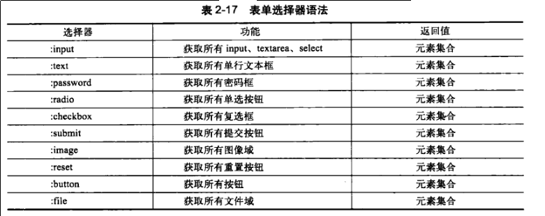

# jQuery Learning Note

学习编程重要的不是语言的语法如何，重要的是这种语言有什么特性，以及如何利用语言的特性实现特定的功能。
尤其是在这种语言之下常用的技巧和常规的使用方法，理解功能怎么用，为什么这么用。
写程序的过程是把功能翻译成逻辑的过程，所以首先要对所要实现的功能熟悉，再次逻辑要清晰，
模块划分要合理，不同部分的连结也要设计合理。

jQuery是一套成熟的js框架。
学习jQuery的功能的同时，最好能够对js有一定程度的了解，同样的功能如果用原生的js如何实现也应该知道，
jQuery只是通过封装让我们的实现变的简单，但并不一定能够完全替代原生的js。

jQuery宗旨: 

> Write Less, Do More.

学习jQuery需要学习jQuery这几方面的功能：

1. 选择器
2. 操作DOM
3. 事件处理
4. 动画特效
5. 功能/工具函数
6. Ajax
7. 常用插件

## jQuery 选择器

学习选择器，需要知道选择器如何使用，在什么情况下使用，不同的选择器能够实现什么功能。
同时还要注意选择器返回的是集合还是单个元素。

### 什么是选择器

简单来说就是用来选择DOM元素的方式方法。

### 选择器的种类

选择器分类示意图如下：[jquery selector referrence][]


#### 1. 基本选择器


#### 2. 层次选择器

层次选择器通过DOM元素间的层次关系获取元素，主要包括后代、父子、相邻、兄弟关系，
如下


__使用__：可以动态的改变DOM的层次结构，动态更新DOM节点的显示情况。

#### 3. 基本过滤选择器

根据指定的规则匹配相应的元素。


__使用__：过滤作用，选择特定的的元素，比如选择含有指定类的元素，不含有指定类的元素，
具有特定条件的index值的元素，奇数/偶数行等。

#### 4. 内容过滤选择器

根据元素中的文字内容或子元素特征进行匹配。

 

#### 5. 可见性过滤选择器

根据元素的可见性过滤


#### 6. 属性过滤选择器

根据元素的属性获取元素，如ID或匹配属性值的内容，以`[`开始`]`结束。


#### 7. 子元素过滤选择器


#### 8. 表单过滤选择器

表单过滤选择器通过表单中对象的属性特征获取元素，比如enabled、disabled、checked、selected。


#### 9. 表单选择器

用于快速定位某表单对象，进行数据的提交或处理。



### 小结

本章介绍了jQuery中不同的选择器和过滤器，选择器和过滤器结合使用可以很方便的选择DOM中的元素进行操作。

_基本选择器_包括ID选择器(id)，类选择器(.class)，标签选择器(div)，匹配所有(*)，以及混合选择(id .class)。  
_层次选择器_根据层次信息选择元素，包括根据祖先后代关系选择(ancestor descendant)，根据父子关系选择(parent child)，
根据相邻关系选择(pre + next)，根据兄弟关系选择(pre ~ siblings)。  
_表单选择器_根据表单元素进行选择，对此要熟悉都有哪些种类的表单元素，以及这些表单元素都有哪些各自特有的属性。
(:input :text :checkbox :password :radio :submit :img :button :reset :file)  

过滤器跟选择器混合使用，当用选择器选中元素集合后，通过附加的过滤器选择其中的一个子集进行操作。  
_基本过滤器_根据指定的规则过滤元素，这些规则包括对元素index的限定过滤(:firt :last :even :odd :lt :gt :eq)，
类型过滤(:header, :animated)，差集过滤(:not(selector))。  
_内容过滤器_根据元素的内容或子元素特征进行过滤。包括直接内容过滤(:contains())，空元素过滤(:empty)，非叶子节点过滤(:parent)，
交集过滤(:has())。  
_可见性过滤器_通过元素的可见性进行过滤，这类过滤器的使用频率比较高，主要用在动态切换元素的情况(:hidden :visible)。  
_属性过滤器_通过元素的属性进行过滤，主要用于对属性值的限定，应用也比较广泛，比如用户可以根据某种规则给元素添加类名称或ID，
那么反过来就可以根据规则通过属性过滤器选择选择对应的元素。
_子元素过滤器_通过元素在其父元素中的位置关系进行过滤，直接选择的是子元素，然后看子元素的位置进行过滤，
功能根基本过滤器类似(:fist-child, :last-child, :only-child :nth-child,)。  
_表单过滤器_根据表单元素的属性特征过滤元素。因此要对不同表单的特点和各自特有属性比较熟悉(:enabled :disabled :selected :checked)。


### 其他特殊的选择器见 [jquery selector referrence][]
[jquery selector referrence]: http://www.w3schools.com/jquery/jquery_ref_selectors.asp


## jQuery 操作DOM

jQuery对DOM的操作主要包括以下几类：  
_访问元素_， _创建节点-插入节点_， _复制节点_， _删除节点_， _替换节点_， _包裹节点_，以及 _遍历节点_，

### 访问元素

访问元素的目的一般是为了操作元素，更改其属性、内容、样式等。

获取/设置_元素属性_的通用方式是`attr(key,[value])`，`attr(key,function(index))`。用函数来指定的属性值的方式使得可以动态的更改属性值。

获取/设置_元素内容_的方式有`html()`和`text()`，这两个函数的区别在于一个操作的是html内容，一个操作的是文本内容。
而且`html()`只支持XHTML文档，不支持XML文档。

获取/设置_元素值_的方式`val()`，**这个方法常用于表单中获取或设置对象的值**。比如获取文本框的值，获取select标记的值等等。
val()函数的返回值和参数可以是数组，比如`$(:radio).val(["radio2","radio3"])`，代表选中ID为radio2和radio3的单选框。

操作元素的_样式_，通过`css(name, value)`给元素指定样式，通过`addClass(class)`给元素增加样式类，通过`toggleClass()`切换样式类，
通过`removeClass(class)`删除样式类。  
**问题:在什么情况下使用样式类，在什么情况下直接操作样式，有没有一个既定的规则可以遵循?**

### 创建节点元素

创建页面元素的方式`$(html)`。
如

```javascript
var $div = $("<div title='jQuery'>Write Less Do More</div>");
$("body").append($div);
```
### 插入节点

#### 内部插入节点的方法：


1. `append(function(index, html))`

	`function()`返回字符串，**参数`index`是对象在集合中的索引值，`html`是该对象原有的html值。**

	```html
	<body>
		<ul id="ul">
			<li></li>
			<li></li>
			<li></li>
		</ul>
		<script>
			$("#ul > li").append(function(index){return index});
		</script>
	</body>
	```

2. `appendTo(content)`是一个相反的过程，将前边的元素插入到后边的元素中，可以**将一个元素同时插入到多个元素**。

#### 外部插入节点


### 复制节点

`clone()`方法，如果需要同时复制元素的行为，使用`clone(true)`，元素的事件行为也会同时被复制。

### 替换节点

`replaceWith(content)`将选择的元素用HTML或DOM元素替换。

`replaceAll(selector)`用选择的元素替换selector指定的元素。

### 包裹节点

包裹节点的方法：


**`wrapInner`**函数用于包裹所选择元素的子元素。


### 删除元素

`remove([expr])`参数为筛选元素的jQuery表达式。

`empty()`清空所选择的页面元素或后代元素。

### 遍历元素

`each()`函数

```javascript
$("img").each(function(index){
	// this is the DOM element
	this.title = "" + index;
	this.src = "_img/image"+index+".png";
});
```

### 综合案例


### 小结

本章主要讲述jQuery对DOM的操作，对DOM的操作一般包括以下几种类型，
_访问节点_， _创建节点_， _复制节点_， _插入节点_， _替换节点_， _包裹节点_， _删除节点_， _遍历节点_。

其中访问节点又包括对节点 _元素属性_， _元素内容_， _元素值_， _元素样式_的获取和设置。

插入节点包括 _内部插入_和 _外部插入_两种方式，

包裹节点包裹 _普通的包裹(wrap)_和 _内部包裹(wrapInner)_两种。

需要掌握常用的对节点的操作方式和对应使用的函数，以及这些操作之间的差异，哪些函数的参数可以使用函数以及函数参数的含义。
还要掌握**这些对节点的操作方式如何有效的结合起来完成一定的功能**，比如上边case study中的功能如何有效的实现。
在实现功能的过程中，首先应该考虑最直观最简单的的方式，不一定是最有效率的方式，完成以后可以再考虑代码如何优化。
高质量的代码一方面需要有写代码的直觉，另一方面也需要积累到一定的代码量。


## jQuery 事件处理

学习jQuery的事件处理，需要了解 _事件机制_和经常使用的事件操作，比如 _绑定事件_， _切换事件_， _移除事件_，
还要学习事件处理的常用应用，一些常用的功能如何跟这些事件处理对应起来。
再有就是熟悉_不同的事件处理程序接收的参数_设置。

### 事件机制

页面加载的时候会出发load事件，button被单击时出发按钮的click事件。事件在元素对象和功能之间起着着桥梁的作用。
严格来说，事件触发后包括了两个阶段，`捕获(capture)`和`冒泡(bubbling)`。大多数浏览器不支持捕获阶段，jQuery也不支持。
冒泡的实质就是事件的执行过程。

_冒泡过程_：设定在元素上的事件被触发时，设置在元素外围的包裹元素上的事件处理程序也会被触发，这就是冒泡过程。
用好冒泡过程能够很大程度上简化程序的编写，比如如果有多个buttom，将事件处理程序设置在多个button的共同祖先(form)上，
在处理程序中动态的判断事件类型和事件源进行处理，省去了为每个元素单独设置事件处理的麻烦。在不需要冒泡的时候，
可以通过`event.stopPropagation()`或者`return false`实现中止冒泡过程。

### Ready事件

jQuery的`ready()`类似与原生js中的`onLoad()`，区别在于`onLoad()`在页面全部元素加载完成后执行，
`ready()`在DOM模型加载完成后执行。

两种常用的写法：

```javascript
// 写法1
$(document).ready(function(){
	// code ...
});
// 写法2
$(function(){
	// code ...
});
```

第一种方法比较直观，第二种方法比较简洁。

### 事件绑定

除了使用`.event-name(function(){})`的方式绑定事件外，还可以通过`bind()`函数绑定事件。
语法格式为：`bind(type,[data], fn)`。


一个元素可以绑定多个事件，中间用空格隔开，`bind("click mouseout", func)`

也可以通过传入一个映射的方式绑定多个事件。`bind({click:fn, focus:fn, change:fn})`

### 切换事件

`hover()`和`toggle()`

#### hover()
`hover()`可以通过事件`mouseover`和`mouseout`实现。
如下代码是等价的

```javascript
$("a").hover(function(){
	// code for over
}, functin(){
	// code for leave
});

$("a").mouseenter(function(){});
$("a").mouseleave(function(){});
```

#### toggle()

`toggle(fn, fn2, [fn3, fn4, ...])`方法，当单击时，按照函数顺序调用。第一次单击时调用第一个函数，第二次单击时调用第二个函数...

### 移除事件

`unbind([type], [fn])`


### 其他事件

#### one()

绑定仅触发一次的事件，`one(type, [data], fn)`

**什么情况下会有这种需要？**

#### trigger()

`trigger(type, [data])`的功能是在所选择的元素上触发指定类型的事件。

_应用_：
有时希望页面在DOM加载完毕后自动执行一些人性化的操作：如文本框中的内容全部被选中，某个按钮处于焦点中。
这些都可以用`trigger()`实现。

**HOW TO?**:需要自己实现一下啊

### 表单应用

#### 文本框事件应用

实现文本框获得焦点和失去焦点样式改变提示，内容检测提示。

#### 下拉列表框事件应用

实现三个下拉列表框联动显示信息。

列表框的内容可以预先用一个数组存储，需要的时候从里边取数据。

**Try Yourself**

#### 列表应用

用列表实现导航栏。因为每个列表项对应的内容基本都是固定的，所以可以预先将内容加入DOM，然后选择性的显示。

#### 网页选项卡应用

### Study Case 删除数据提示效果实现。

如何添加mask， window.resize事件如何使用，如何添加对话框等。

### 小结

这章主要介绍了事件处理的基本知识，包括事件机制，事件的绑定和移除，jQuery特有提供的事件切换以及几个常用的事件。
通过几个示例和Study Case介绍这些如何把事件应用到具体的功能实现上。
具体来说，_事件机制_说到了`事件冒泡`和阻止事件冒泡的方法。在_事件绑定_上，有两种方式，最常用的是`.event_name(fn)`的方式，
通用的是用`bind(type,[data],fn)`函数绑定函数。_事件解绑_定上，可以通过`unbind([type],[fn])`函数实现，通过两个参数的搭配，
可以实现解除所有事件，解除特定类型的所有事件，解除特定类型的特定事件三个层次的解绑定。在_事件切换_上，
主要有`hover()`和`toggle()`两个常用的函数，`hover()`函数使得添加`mouseover`和`mouseout`两个事件更加方便。
`toggle()`函数使得可以单击事件可以在几个处理函数之间来回切换。其他还有`one()`和`trigger()`两个函数，
一个用于设置只触发一次的事件，一个用于与用户在代码中手动的触发事件，比如一些设定自动执行的事件等。其次还介绍了和原生js中`onLoad()`
对应的`ready()`函数的使用。

事件处理多用在表单的处理上，所以也介绍了几个在事件处理在表单中的应用。比如**处理文本框事件**，在文本框获取和失去焦点时应用不同的样式，
失去焦点时根据填入的内容给用户提示(如email地址合法检测)等。**下拉列表框的联动**，三个下拉列表框分属三个层次，高层次的内容改变时动态更新
低层次的下拉列表框的内容。用侧边栏实现**导航功能**以及**选项卡功能**。这些都是实际过程中经常用到的一些功能，
通过这些示例说明事件处理的应用。

最后的Case Study通过实现**删除数据对话框提示效果**说明事件处理的应用。

看完这章，对于以上提到的几个示例的实现应该自己可以实现，同时，要注意CSS类的设计和事件处理的结合使用，**如何合理的设计CSS类？**
还以留意事件流的过程，通过分析事件流来学习事件处理的设计。


## 动画与特效

网页中最基本的动画特效包括：元素的显示与隐藏，滑动效果，淡入淡出效果以及自定义的动画效果。

### 显示与隐藏

#### `show()` `hide()`

原生JS实现元素的显示和隐藏通过设置CSS的`display:none/block`属性来实现。
jQuery通过`.css(key,value)`也可以方便的实现，jQuery还提供了`show()`和`hide()`两个函数来实现元素的显示和隐藏。
原型如下

- `show(speed, [callback])`
- `hide(speed, [callback])`

通过设置spped可以实现动画效果，通过callback参数可以设置动画完成时执行的回调函数。
比如动画的方式显示图片，在图片显示完成后改变图片的边框样式或者给图片添加滤镜效果等。

#### `toggle()`


