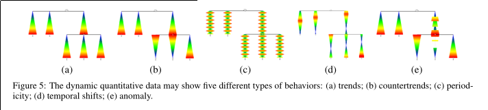
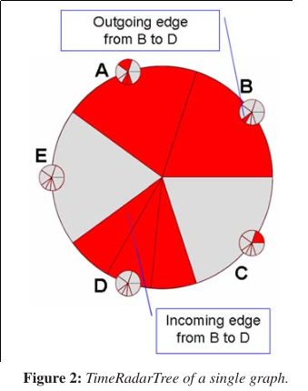

## SpaceTree: Supporting Exploration in Large Node Link Tree, Design Evolution and Empirical Evaluation

- Author: Catherine Plaisant, Jesse Grosjean, Benjamin B. Bederson
- Affiliation: Human-Computer Interaction Laboratory University of Maryland

### Abstract
Tree Broswer, Dynamic Rescaling of Branches, Integreted Search and Filter Function.  
This paper reflects on the evolution of the design and highlights the principles that emerged from it.

### Related Work
Space-Filling, Node-Link, Focus+Context(Overview+Detail), 3D Approach, Circular Layout,  
Focus Switch(refine the focus of interest)

## EncCon: an approach to constructing interactive visualization of large hierarchical data

- Author: Quang Vinh Nguyen, Mao Lin Huang
- Affiliation: Department of Computer Systems,
  Faculty of Information Technology,
	University of Technology, Sydney

### Contributes
`EncCon` for visualizing and navigating large hierarchical information.

### Techniques

- enclosure + connection method
	- This visualization aims to maximize the utilization of display space
	  while retaining a good geometrical layout as well as a clear (explicit)
		presentation of the hierarchical structure of graphs.
-	rectangular division algorithm
- an experimental evaluation of EncCon’s layout algorithm
- a new focusþcontext viewing technique for the navigation of large hierarchies
	- zooming-layering concept rather than traditional enlarge + embedded concept

### Differences
### Benefits
### Content

__Design of Interactive Visualization:__

- Layout Design
- Navigation Design

__Navigation Techniques:__

- focus+context
	- Fisheye Views
	- Polyfocal Display
	- Bifocal Lens
	- Perspective Wall
	- Hyperbolic Browser
- zooming+filtering
	- Starfield Display
	-	Tree-Maps
	-	Pad
	-	Pad++ 
	-	Piccolo
- incremental exploration

__What's the difference between `focus+contex` and `zooming+filtering`?__

### Evaluation: compare with squrified treemap

- Less edge crossings: two out of five data sets
- Little angular resolution: just slightly
- Average edge length: not better

> for medium and moderately large data sets EncCon’s
partitioning performs significantly better

### Questions

_What does the name of `EncCon` mean?_

the technique used in this paper is a `enclosure` and `connection`
approach.

_Why context view is essential? Some examples?_
> This allows users to maintain
the perception of where they are and where they can
move from during the navigation of large information
spaces.

_Focus+Context technique, Zooming+Filtering technique and Incremental Exploration?_
> Filtering the information in the form of selecting a
subset of the data along a range of numerical values of
one or more dimension.

_What are `landmark node` and `history path` mechanisms in zooming+context
and incremental exploration techniques?_
> to show the contextual information to a certain
degree during the navigation.

_What't the design consideration?_

- space utilization
- fast computation
- minimization the human cognitive process: fade in/out animation

_This paper use squarified rectangle for the area division, what's the difference
with squarified treemaps?_
> In Squarified Tree-Maps, the partitioning is accomplished through
the horizontal-vertical manner. In EncCon, this is achieved
in the circular manner, in which all rectangles are placed in the
north–east–south–west order around four sides of the parent rectangle.

## TreeJuxtaposer: Scalable Tree Comparison using Focus+Context with Guaranteed Visibility

- Author: Tamara Munzner, Francois Guimbretiere, Serdar Tasiran, Li Zhang, Yunhong Zhou
- Affiliation: 

### Abstract
Structual comparison of large trees.  
System designed to support the comparison task for large trees of several hundred thousand nodes.  
Concept of "Guaranteed Visibility"  
A new Methodology for detailed structural comparison between two trees.  
A new nearly-linear algorithm for computing the best corresponding node from one tree to another.  
A new rectilinear Focus+Context technique for navigation.  

## TreePlus: Interactive Exploration of Networks with Enhanced Tree Layouts

- Author: Bongshin Lee, Cynthia S. Parr, Catherine Plaisant, Benjamin B. Bederson, Vladislav D. Veksler, Wayne D. Gray, and Christopher Kotfila
- Affiliation: Human-ComputerInteractionLaboratoryattheUniversity of Maryland
- Year: 2006

### Abstract
effective interactive layouts for large graphs.  
“Plant a seed and watch it grow.”  

### Design Goals

- Take advantage of human perception of trees
- make as many nodes of readable as apssible
- maximize stability of layout
- offer preview before commiting
- provide multistep animations so users can follow changes

### Showing hidden graph structure

- hilighting and preview of adjacent nodes
- animated update of tree structure
- visual hints of graph structure

### Questions

__What makes this paper special?__

__What problems does this paper solve?__

## Visual Exploration of Time-Series Data with Shape Space Projections

__not quite understand this paper tell__

- Author: Matthew O. Ward and Zhenyu Guo
- Affiliation: Computer Science Department Worcester Polytechnic Institute Worcester, MA USA
- Year: 2011

### Abstract

Time-series Data Visulization  
Typical tasks: identifying cyclic behaviour, outliers, trends, periods of time that share distinctive shape characteristic.  
None to date is a complete solution.  
Borrowing idea from text analysis, [n-gram][]

[n-gram]: http://en.wikipedia.org/wiki/N-gram

## VISUALIZING DYNAMIC QUANTITATIVE DATA IN HIERARCHIES TimeEdgeTrees: Attaching Dynamic Weights to Tree Edges

- Author: Michael Burch, Daniel Weiskopf
- Affiliation: VISUS, University of Stuttgar
- Year: IVAPP2011

### Abstract

visualizing the dynamics of quantitative data in static hierarchical structure.  
orthogonal tree diagrams as a timeline.  
use color coding and varying thicknesses to represent the time-varying data.  
explore trends, countertrends, periodicity, temporal shifts, or anomalies during the evolution synchronously.

### Interactive Features

- expanding and collapsing of subhierarchies
- selecting specific time interval
- weight filtering
- geometric zomming
- apply color coding
- thickness slider
- labeling
- detail-on-demand

### Applications
water level data for German rivers

### Questions
__Any drawbacks of this vis technique?__

It shows the characteristics of some nodes, while we couldn't get the
comparison info from this technique.

__Basic idea of TimeEdgeTree?__

encode time information on edges

## TimeRadar Trees: Visualizing Daymamic Compound Digraphs

- Author: M.Burch, S.Diehl
- Affiliation: University of Trier, Germany
- Year: VGTC2008

### Basic Idea
It uses radial tree layout to draw the hierarchy, and circle sectors to represent the temporal change of edges in the digraphs.  
several interaction techniques that allow the users to explore the structural and temporal data.  
Smooth animations help them to track the transitions between views.  
visualize dependencies between elements in the hierarchy.

this paper gives a different point on tree/graph, it visualizes 
the weighted relation of node in tree/graph.
it use circle sectors to represent edges.

**common ways to represent edges**:color, shape, style, thickness, orientation, connection

### encoding

advantage: no edge crossings leading to visual cluster

### Applications

### Soccer Match Result

### Triplet Codes in Gene Sequence

encode the codon distribution in gene sequence.

advantage: it encode the match to color in outer circle, so 
it can be used to get an overview of the incomming edges.
a detail-on-demaind request may help to explore info at match level.

### Questions

__What's the meaning of "sequences of compound digraphs with edge weights"?__

__TimeRadarTree, what's the relation with time?__

### Comments

这篇论文的主要不同之处在于对图或者树的加权边进行可视化，通过encode边来显示点与点之间的关系。
从一个Overview中可以看出关系的大体情况，从这点出发，用户可以发现一些有价值的信息，再进行深一步的探索。
交互方式主要集中于zoom in/out以及highlight，brushing，tool tips上。
平滑的动画(smooth animatiion)有助于用户跟踪可视结果的变化。
**Application Domains**: 层次数据中叶子节点之间的关系，所以app domain比较局限在这一类特殊的tree上，
